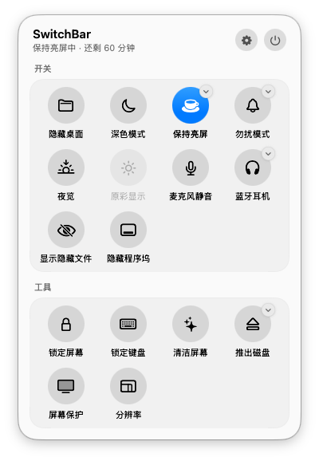
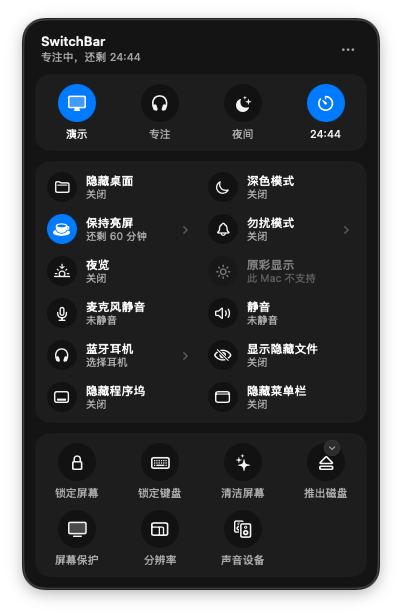
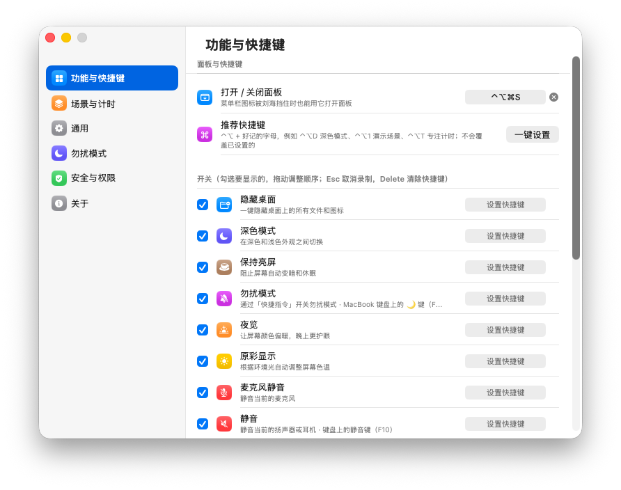
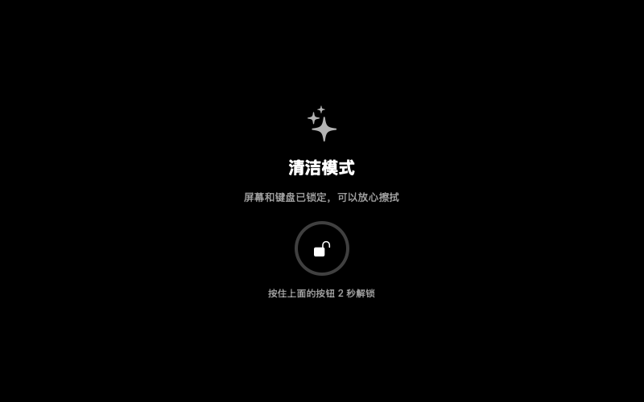

# SwitchBar

一个**完全离线、源码公开**的 macOS 菜单栏开关工具，功能参照 One Switch：把隐藏桌面、深色模式、保持亮屏、勿扰模式、夜览、连接 AirPods、切换分辨率这些常用开关集中到菜单栏的一个面板里，点一下就切换，也可以给每个开关设置全局快捷键。

界面按 macOS 26 / 27 的「液态玻璃」风格设计：面板像控制中心一样从菜单栏下方展开；在 macOS 13–15 上会自动换成毛玻璃样式。

<p>
  
  
</p>

> 截图由 CI 在 macOS 26 虚拟机上自动截取；「原彩显示」变灰是因为虚拟机没有支持原彩的屏幕。

## 为什么自己写一个

| | SwitchBar 的做法 |
|---|---|
| 源码 | 全部开源，约 2600 行 Swift，自己审查、自己编译 |
| 网络 | **代码里没有任何网络请求**。`scripts/audit.sh` 会检查，CI 里如果发现网络代码会直接失败 |
| 依赖 | 零第三方依赖，只用苹果系统框架（`Package.swift` 里没有 dependencies） |
| 数据 | 设置只保存在本机 `~/Library/Preferences/local.switchbar.plist` |
| 权限 | 按需申请：只有用到对应功能时，系统才会弹窗询问 |
| 安装包 | Releases 里的安装包由 GitHub Actions 从这份源码自动构建，附 SHA-256 校验值；也可以自己编译 |

## 功能

点菜单栏图标（或按 **⌃⌥⌘S**）打开面板；图标右上角带小箭头的开关还有更多选项。点面板外面或按 Esc 关闭，不会抢走当前应用的焦点。

| 开关 | 说明 | 实现方式 | 需要的权限 |
|---|---|---|---|
| 隐藏桌面 | 一键隐藏 / 显示桌面上的所有图标 | `defaults write com.apple.finder CreateDesktop` + 重启访达 | 无 |
| 深色模式 | 切换深色 / 浅色外观 | AppleScript 控制「系统事件」 | 自动化（首次询问） |
| 保持亮屏 | 阻止屏幕自动休眠，可选 15 分钟 ~ 8 小时或一直保持 | IOKit 电源断言（和 `caffeinate -d` 相同） | 无 |
| 勿扰模式 | 开 / 关勿扰 | 系统「快捷指令」（需要一次性设置，见下文） | 无 |
| 夜览 | 开 / 关夜览 | CoreBrightness（系统设置自己用的框架） | 无 |
| 原彩显示 | 开 / 关原彩（仅支持的 Mac 显示） | CoreBrightness | 无 |
| 麦克风静音 | 静音当前输入设备 | CoreAudio 设备属性（不采集声音） | 无 |
| 蓝牙耳机 | 一键连接 / 断开选中的 AirPods 等耳机 | IOBluetooth | 蓝牙（首次询问） |
| 显示隐藏文件 | 访达里显示 / 隐藏以 `.` 开头的文件 | `defaults write com.apple.finder AppleShowAllFiles` | 无 |
| 隐藏程序坞 | 开 / 关程序坞自动隐藏 | AppleScript 控制「系统事件」 | 自动化（首次询问） |
| 锁定屏幕 | 立即锁屏（等同 ⌃⌘Q） | login 框架 `SACLockScreenImmediate` | 无 |
| 锁定键盘 | 擦键盘、防猫踩；鼠标点「解锁」恢复 | CGEventTap 拦截按键 | 辅助功能 |
| 清洁屏幕 | 全屏变黑 + 锁键盘 + 屏蔽触控板手势，按住按钮 2 秒解锁 | CGEventTap | 辅助功能 |
| 推出磁盘 | 推出所有外接磁盘、磁盘映像、网络宗卷，或单独推出某一个 | FileManager | 无 |
| 屏幕保护 | 立即启动屏幕保护程序 | 打开系统自带的 ScreenSaverEngine | 无 |
| 分辨率 | 给每台显示器切换分辨率，支持多台外接屏 | CoreGraphics | 无 |

在「设置 › 功能与快捷键」里可以：勾选要显示的开关、拖动调整顺序、为每个开关录制全局快捷键（例如 ⌃⌥D 切换深色模式）。用快捷键操作时屏幕下方会短暂显示提示。



清洁屏幕模式（按住按钮 2 秒解锁，防止擦屏幕时误触）：



> 锁定键盘时如果 SwitchBar 意外退出，系统会自动撤销拦截，键盘不会一直失灵；鼠标 / 触控板全程可用。

## 安装

需要 macOS 13 Ventura 或更新版本（推荐 macOS 26 及以上，可以看到液态玻璃效果）。

### 方法一：从 Releases 下载（推荐，最简单）

1. 打开 [Releases 页面](https://github.com/eric-prog998/mac-SwitchBar/releases/latest)，下载 `SwitchBar-vX.Y.Z.zip`（仓库是私有的，需要先登录 GitHub）。
2. 双击解压，把 **SwitchBar.app** 拖进「应用程序」文件夹。
3. SwitchBar 没有经过苹果公证（需要付费开发者账号），系统默认会拦下从网上下载的应用。打开「终端」执行一次：

   ```bash
   xattr -dr com.apple.quarantine /Applications/SwitchBar.app
   ```

   或者：先双击打开一次，被拦下后到「系统设置 › 隐私与安全性」，在页面底部点「仍要打开」。
4. 打开 SwitchBar，菜单栏右上角会出现一个开关图标。
5. 想开机自动启动：面板右上角齿轮 › 通用 › 勾选「登录时自动启动」。

**校验安装包（可选）**：每个版本的 Releases 页面都附有 SHA-256，和下面命令的输出一致就说明文件没被篡改：

```bash
shasum -a 256 ~/Downloads/SwitchBar-v1.0.0.zip
```

**升级**：退出旧版（面板右上角的电源按钮），下载新版替换掉「应用程序」里的旧版，再执行一次上面的 `xattr` 命令。每个版本的签名不同，「锁定键盘」用到的「辅助功能」权限需要在系统设置里删掉 SwitchBar 后重新添加。

### 方法二：自己编译（大约 1 分钟）

1. 安装编译工具（已经装了 Xcode 可以跳过）：

   ```bash
   xcode-select --install
   ```

2. 下载源码并安装：

   ```bash
   git clone https://github.com/eric-prog998/mac-SwitchBar.git
   cd mac-SwitchBar
   make install
   ```

   仓库是私有的，`git clone` 时会要求登录 GitHub；也可以用 GitHub Desktop 克隆，然后在终端里 `cd` 到克隆下来的文件夹执行 `make install`。

   脚本会编译出 `dist/SwitchBar.app`，复制到「应用程序」文件夹并启动。用 Xcode 26 或更新版本编译才会包含液态玻璃效果。

以后更新代码后，再执行一次 `make install` 即可。

#### 推荐：创建本地签名证书（只需一次）

macOS 用代码签名来识别「是不是同一个应用」。默认的临时签名每次编译都会变，导致**每次重新编译后都要重新授予「辅助功能」权限**。创建一个只存在于你本机的自签名证书就能避免：

1. 打开「钥匙串访问」→ 菜单栏「钥匙串访问」›「证书助理」›「创建证书…」
2. 名称填 `SwitchBar Local`，身份类型选「自签名根证书」，证书类型选「**代码签名**」，点「创建」
3. 重新执行 `make install`，脚本会自动使用这个证书（第一次可能会询问是否允许 codesign 使用钥匙串，点「始终允许」）

这个证书只在你的电脑上，不需要 Apple 开发者账号。

### 发布新版本

推送一个 `v` 开头的标签，GitHub Actions 会自动在 macOS 上构建、打包，并把 `SwitchBar-vX.Y.Z.zip` 和校验值上传到 Releases（流程见 `.github/workflows/release.yml`）：

```bash
git tag v1.0.1
git push origin v1.0.1
```

## 14 英寸 MacBook Pro 小贴士

- **菜单栏图标被刘海挡住了？** 菜单栏图标多的时候，新加入的图标会被挤到刘海后面。可以：
  - 按 **⌃⌥⌘S** 直接打开面板（在 设置 › 功能与快捷键 里可以改）；
  - 按住 ⌘ 把 SwitchBar 图标拖到靠右的位置，SwitchBar 会记住这个位置；
  - macOS 26 及以上可以在「系统设置 › 菜单栏」里隐藏不常用的图标。
- **面板大小**：面板约 380 × 480 点，在 14 英寸屏幕所有缩放档位（包括「更大字体」1024 × 665）下都能完整显示。
- **分辨率**：「分辨率」菜单里的内建显示器选项和「系统设置 › 显示器」一致，最大的一档标注「更多空间」，最小的一档标注「更大字体」，系统默认档标注「默认」；ProMotion 会保持当前刷新率。
- **原彩显示、夜览**：内建屏幕都支持。

## 勿扰模式的一次性设置

macOS 没有公开接口可以切换勿扰模式，SwitchBar 借助系统自带的「快捷指令」完成（不需要额外权限）：

1. 打开「快捷指令」App，新建快捷指令，添加操作「**设定专注模式**」，设为「打开 勿扰模式」，命名为 `开启勿扰`
2. 再新建一个，设为「关闭 勿扰模式」，命名为 `关闭勿扰`
3. 在 SwitchBar 设置 › 勿扰模式 里点「检查」，看到 ✅ 就完成了（名字也可以在这里改）

## 权限说明

| 权限 | 哪个功能用 | 在哪里管理 |
|---|---|---|
| 辅助功能 | 锁定键盘、清洁屏幕 | 系统设置 › 隐私与安全性 › 辅助功能 |
| 自动化 › 系统事件 | 深色模式、隐藏程序坞 | 系统设置 › 隐私与安全性 › 自动化 |
| 蓝牙 | 蓝牙耳机 | 系统设置 › 隐私与安全性 › 蓝牙 |

全局快捷键使用系统的 `RegisterEventHotKey`，只会收到你注册的那几个组合键，**看不到你打的其他任何字**，也不需要「输入监控」权限。

## 安全自查

```bash
make audit
```

会列出：

1. 网络相关代码（应该为空）
2. 会执行的外部命令：只有 `/usr/bin/defaults`、`killall`、`pmset`、`shortcuts`，全部是 macOS 自带
3. 用到的非公开系统框架：`CoreBrightness`（夜览、原彩）、`login`（锁屏）
4. 第三方依赖（应该为空）

代码结构：

```
Sources/SwitchBar/
├── App/        入口（Snapshot.swift 只在调试版里存在，CI 用它渲染截图）
├── Core/       开关列表、用户设置、统一的状态与操作（SwitchStore）
├── System/     每个系统功能的具体实现，一个文件一类功能
├── HotKeys/    全局快捷键
└── UI/         菜单栏面板、设置窗口、提示框、锁定界面
```

## 卸载

1. 面板 › 设置 › 通用 › 取消「登录时自动启动」
2. 退出 SwitchBar，把「应用程序」里的 SwitchBar 删掉
3. 删除设置：`defaults delete local.switchbar`
4. 在 系统设置 › 隐私与安全性 的「辅助功能」「自动化」「蓝牙」里移除 SwitchBar

## 常见问题

**锁定键盘提示「无法拦截键盘」？** 重新编译后旧的授权失效了。到「辅助功能」里选中 SwitchBar 点「−」删除，再重新打开锁定键盘，按提示重新授权。按上面的方法创建本地签名证书可以一劳永逸。

**深色模式 / 隐藏程序坞没反应？** 第一次使用时系统会问「是否允许 SwitchBar 控制系统事件」，需要点「好」。如果之前点了「不允许」，到「自动化」里重新打开。

**锁定屏幕后没有要求密码？** 如果系统将来移除了锁屏接口，SwitchBar 会改为让显示器立即休眠，此时需要在 系统设置 › 锁定屏幕 里把「显示器关闭后需要密码」设为「立即」。

**锁定键盘时电脑睡着了怎么办？** 合上屏幕、电脑睡眠或锁屏时，SwitchBar 会自动解除键盘锁定，回来后可以正常输入密码。

**勿扰模式开关状态不准？** 如果系统允许读取专注模式状态，SwitchBar 显示的就是真实状态；否则显示的是上一次通过 SwitchBar 操作的结果。点开关右上角箭头可以直接选「开启」或「关闭」。
